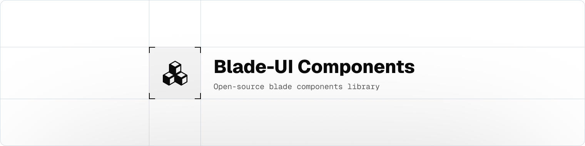

<a href="https://jaypalsapara.in">
  <picture>
    <source media="(prefers-color-scheme: dark)" srcset="public/images/art/header-dark.png">
    
  </picture>
</a>

# Blade-UI

.vscode/settings.json

```json
{
    "editor.wordWrap": "wordWrapColumn",
    "editor.wordWrapColumn": 120,
    "tailwindCSS.experimental.classRegex": [
        // Variable ending with 'Classes' assigned a plain string
        ["[a-zA-Z]+Classes\\s*=\\s*[`'\"]([^`'\"]*)[`'\"]"],
        // Variable ending with 'Classes' assigned an array
        ["[a-zA-Z]+Classes\\s*=\\s*\\[([^\\]]*)\\]", "[`'\"]([^`'\"]*)[`'\"]"],
        // Variable ending with 'Classes' = match() — string values after =>
        ["[a-zA-Z]+Classes\\s*=\\s*match\\s*\\([^)]*\\)\\s*\\{([^}]*)\\}", "=>\\s*[`'\"]([^`'\"]*)[`'\"]"],
        [
            "[a-zA-Z]+Classes\\s*=\\s*match\\s*\\([^)]*\\)\\s*\\{([^}]*)\\}",
            "=>\\s*\\[[^\\]]*\\]",
            "[`'\"]([^`'\"]*)[`'\"]"
        ],
        // Variable ending with 'Classes' = match() — array values after =>
        [
            "[a-zA-Z]+Classes\\s*=\\s*match\\s*\\([^)]*\\)\\s*\\{(?:[^}]*=>\\s*\\[([^\\]]*)\\])+\\s*\\}",
            "[`'\"]([^`'\"]+)[`'\"]"
        ]
    ]
}
```
