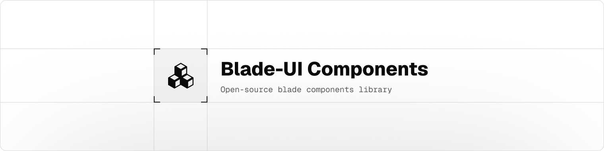

<a href="https://jaypalsapara.in">
  <picture>
    <source media="(prefers-color-scheme: dark)" srcset="public/images/art/header-dark.png">
    
  </picture>
</a>

# sharkvel/blade-ui

Open-source, production-ready components built to accelerate Laravel development while giving you full control to customize, extend, and scale.

## Documentation

Visit [https://blade-ui.sharkvel.com/docs](https://blade-ui.sharkvel.com/docs)

## Contributing

Please read the [contributing guide](/CONTRIBUTING.md)

## License

Licensed under the [MIT license](/LICENSE.md).
